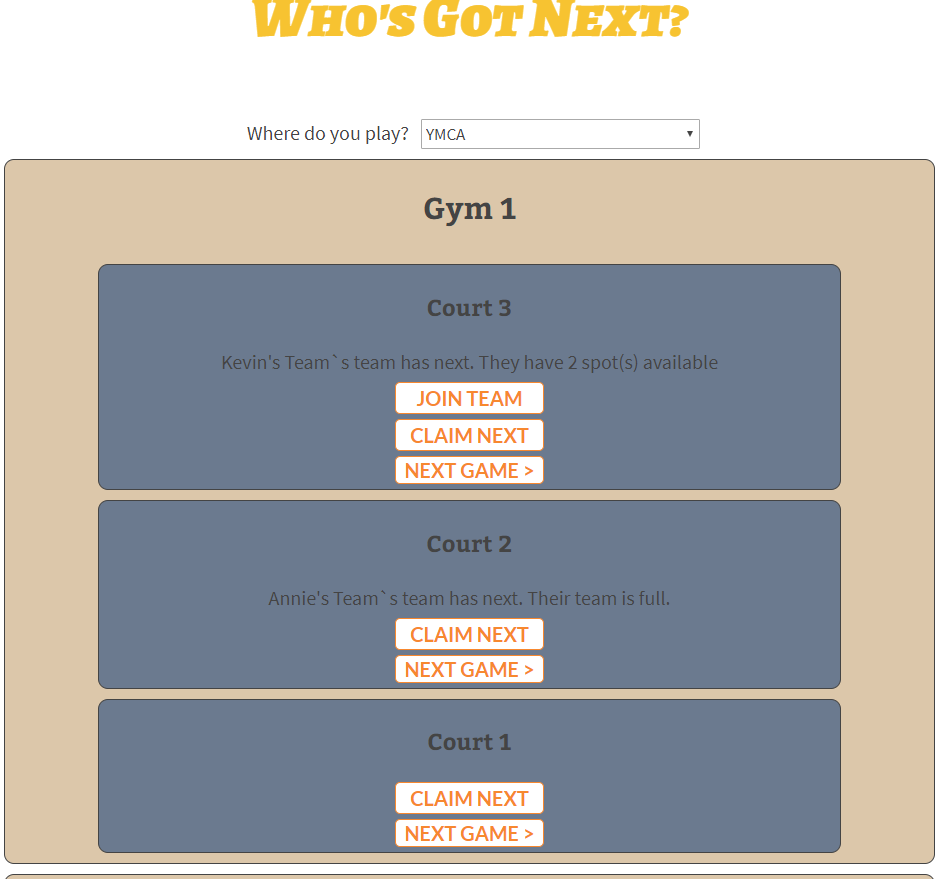

## Who's Got Next?

Here is the link to the [live app](https://kclynch94-whos-got-next-app.now.sh/).

## Summary

This app is designed to help local backetball players see what courts have active players. In addition to that, it solves the problem of debating 'Who's Got Next?' or what team is next in line to play on a certain court.

### Claim the court

Who's Got Next? allows you to be be next in line to play on a basketbaall court. Claim the spot for you or your whole team

### See who's playing

Use the app to see what courts near you have active games. Don't drive out to the court just to see no one is there. Find the courts with live games you could join in on. Call up your friends or just find a team the needs an extra player.

### White Label

Who's Got Next? is a white label product that is designed to be rebranded to fit any organization. For demonstration purposes, the next page includes a few examples of organizations to choose from (Community Centers, Fitness Gym, Universities). Click through to see the courts interface!

## API Endpoints

The base URL of the API is https://sleepy-coast-68561.herokuapp.com/api

This API is authenticated so only users with a valid API token will be able to access it.

This API has endpoints for the following:
* /organizations
* /teams
* /courts
* /facilities

All of the endpoints have CRUD operations

## Technology Used

* React
* CSS
* Node
* Express
* PostgreSQL
